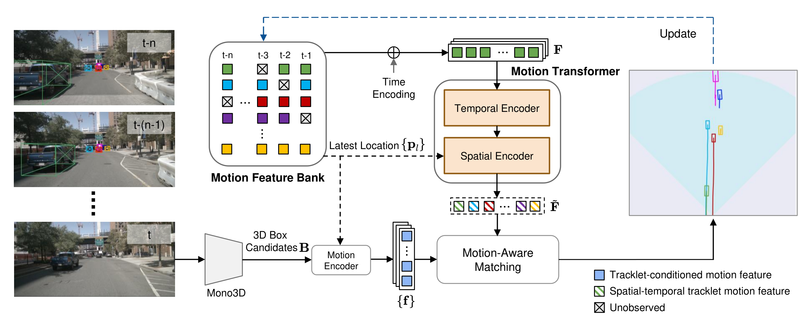

# MoMA-M3T
**Delving into Motion-Aware Matching for Monocular 3D Object Tracking** (ICCV 2023) [[paper](https://arxiv.org/abs/2308.11607)]\
Kuan-Chih Huang, Ming-Hsuan Yang, Yi-Hsuan Tsai.

The code is coming soon.



## Citation
 ```
@inproceedings{huang2023momam3t,
    author = {Kuan-Chih Huang, Ming-Hsuan Yang and Yi-Hsuan Tsai},
    title = {Delving into Motion-Aware Matching for Monocular 3D Object Tracking},
    booktitle = {ICCV},
    year = {2023}    
}
 ```
